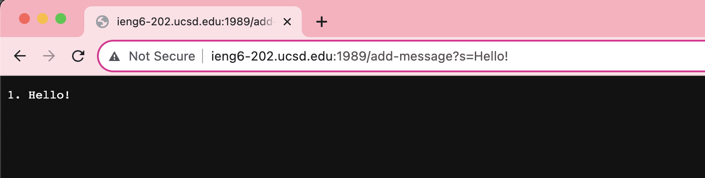

**Lab Report 2 - Servers and SSH Keys**    

**Part 1**  
Code of StringServer.java
  

1) **Screenshot of using /add-message**  
  
**Methods called in handleRequest upon using /add-messages?s=Hello:**  
- .getPath()
- .equals()
- .format()
- .contains()
- .getQuery
- .split()
- .toString()
- .length

- **What are the relevant arguments to those methods, and the values of any relevant fields of the class?**
Relevant arguments to the above methods:
the URI url  

- **How do the values of any relevant fields of the class change from this specific request? If no values got changed, explain why**
Values changed: count changes, str changes  

2) **Screenshot of using /add-message**  
  
- Which methods in your code are called?

- What are the relevant arguments to those methods, and the values of any relevant fields of the class?

- How do the values of any relevant fields of the class change from this specific request? If no values got changed, explain why

**Part 2**  
Using the command line, show with ls and take screenshots of: 
The path to the _private_ key for your SSH key for logging into ieng6 (on your computer or on the home directory of the lab computer)
The **path to the _public_ key for your SSH key for logging into ieng6** (within your account on ieng6)

Logging into ieng6 with course-specific account without being asked for a password:

**Part 3**  
In a couple of sentences, describe something you learned from lab in week 2 or 3 that you didn’t know before.
In lab, I learned about how to ssh into a remote server. I also learned how to make a new server and run it.
