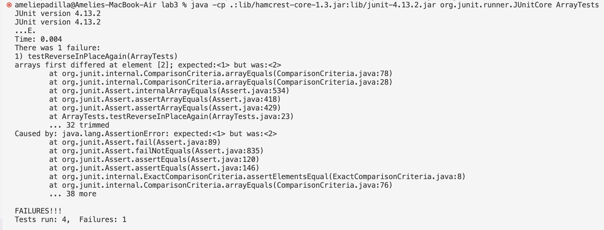

### **Part 1 - Bugs**

**Failure-inducing input:**
```
  @Test
  public void testReverseInPlaceAgain() {
    int[] input1 = {0, 1, 2, 3};
    ArrayExamples.reverseInPlace(input1);
    assertArrayEquals(new int[]{3, 2, 1, 0}, input1);
  }
```

**An input that doesn’t induce a failure, as a JUnit test and any associated code (write it as a code block in Markdown)**
```
@Test 
	public void testReverseInPlace() {
    int[] input1 = { 3 };
    ArrayExamples.reverseInPlace(input1);
    assertArrayEquals(new int[]{ 3 }, input1);
	}

```

**The symptom:**




**The bug and its fixed version:**

**Before:**
```
  static void reverseInPlace(int[] arr) {
    for(int i = 0; i < arr.length; i += 1) {
      arr[i] = arr[arr.length - i - 1];
    }
  }
```
**After:**
```
 static void reverseInPlace(int[] arr) {
    int hold;
    for(int i = 0; i < (arr.length/2); i += 1) {
      hold = arr[i];
      arr[i] = arr[arr.length - i - 1];
      arr[arr.length - i -1] = hold;
    }
  }
```

**Why the fix works:**

Previously, reverseInPlace would loop through the array, replacing each element with the element opposite it. However, it does not save the element that is being replaced, meaning that element is unable to be put somewhere else in the array as it is lost. As the variable i increases, elements begin to get replaced with the same element, rather than the element that was lost - the correct element. 

To fix this, I only looped through half of the array instead of the entirety of it. This allowed me to swap elements with each other instead replacing them each individually, as shown in the body of the for loop. As the loop runs, the element at index i is held temporarily in the hold variable so that its value is not lost when the reverse value is put into the array at index i. Then, the old value in hold replaces the reverse value in index arr.length - i - 1. This correctly swaps the values.

### **Part 2 - Researching Commands**

**The Grep Command**

Online, find 4 interesting command-line options or alternate ways to use the command you chose. 

For each of those options, give 2 examples of using it on files and directories from ./technical. 
Show each example as a **code block** that shows the command and its output, and write a sentence or two about what it’s doing and why it’s useful.

That makes 8 total examples, all focused on a single command. There should be two examples each for four different command-line options. 
Many commands like these have pretty sophisticated behavior possible – it can take years to be exposed to and learn all of the possible tricks and inner workings.

grep -c
2 examples
```
[cs15lfa23kb@ieng6-201]:technical:148$ grep -c "cell" ./biomed/*.txt
./biomed/1468-6708-3-1.txt:4
./biomed/1468-6708-3-10.txt:0
./biomed/1468-6708-3-3.txt:1
./biomed/1468-6708-3-4.txt:0
./biomed/1468-6708-3-7.txt:3
./biomed/1471-2091-2-10.txt:58
./biomed/1471-2091-2-11.txt:153
(etc.)
```

```
[cs15lfa23kb@ieng6-201]:technical:148$ grep -c "California" ./911report/*.txt
./911report/chapter-1.txt:0
./911report/chapter-10.txt:0
./911report/chapter-11.txt:1
./911report/chapter-12.txt:0
./911report/chapter-13.1.txt:0
./911report/chapter-13.2.txt:0
./911report/chapter-13.3.txt:0
(etc.)
```
What it's doing and why it's useful: 


grep -h
2 ex

grep -l
2 ex

grep -n
2 ex

All command line options for grep were found on https://www.geeksforgeeks.org/grep-command-in-unixlinux/
