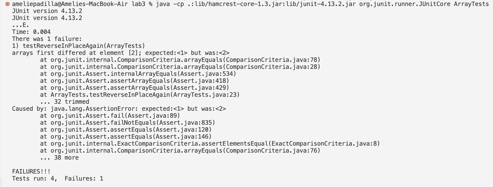

### **Part 1 - Bugs**

**Failure-inducing input:**
```
  @Test
  public void testReverseInPlaceAgain() {
    int[] input1 = {0, 1, 2, 3};
    ArrayExamples.reverseInPlace(input1);
    assertArrayEquals(new int[]{3, 2, 1, 0}, input1);
  }
```

**An input that doesn’t induce a failure:**
```
@Test 
	public void testReverseInPlace() {
    int[] input1 = { 3 };
    ArrayExamples.reverseInPlace(input1);
    assertArrayEquals(new int[]{ 3 }, input1);
	}

```

**The symptom:**




**The bug and its fixed version:**

**Before:**
```
  static void reverseInPlace(int[] arr) {
    for(int i = 0; i < arr.length; i += 1) {
      arr[i] = arr[arr.length - i - 1];
    }
  }
```
**After:**
```
 static void reverseInPlace(int[] arr) {
    int hold;
    for(int i = 0; i < (arr.length/2); i += 1) {
      hold = arr[i];
      arr[i] = arr[arr.length - i - 1];
      arr[arr.length - i -1] = hold;
    }
  }
```

**Why the fix works:**

Previously, reverseInPlace would loop through the array, replacing each element with the element opposite it. However, it does not save the element that is being replaced, meaning that element is unable to be put somewhere else in the array as it is lost. As the variable i increases, elements begin to get replaced with the same element, rather than the element that was lost - the correct element. 

To fix this, I only looped through half of the array instead of the entirety of it. This allowed me to swap elements with each other instead replacing them each individually, as shown in the body of the for loop. As the loop runs, the element at index i is held temporarily in the hold variable so that its value is not lost when the reverse value is put into the array at index i. Then, the old value in hold replaces the reverse value in index arr.length - i - 1. This correctly swaps the values.

<br />

### **Part 2 - Researching Commands**

Note: All commands below were run in the ./technical directory.

**The Grep Command**

<br />

**grep -c**

```
[cs15lfa23kb@ieng6-201]:technical:148$ grep -c "cell" ./biomed/*.txt
./biomed/1468-6708-3-1.txt:4
./biomed/1468-6708-3-10.txt:0
./biomed/1468-6708-3-3.txt:1
./biomed/1468-6708-3-4.txt:0
./biomed/1468-6708-3-7.txt:3
./biomed/1471-2091-2-10.txt:58
./biomed/1471-2091-2-11.txt:153
(etc.)
```
The command grep -c finds the numbers of lines that contains the pattern in the quotation marks. It's useful for finding the frequency of certain words or phrases. In the above example, the command searches for all mentions of "cell." The number of mentions is shown to the right of the file path.
```
[cs15lfa23kb@ieng6-201]:technical:148$ grep -c "California" ./911report/*.txt
./911report/chapter-1.txt:0
./911report/chapter-10.txt:0
./911report/chapter-11.txt:1
./911report/chapter-12.txt:0
./911report/chapter-13.1.txt:0
./911report/chapter-13.2.txt:0
./911report/chapter-13.3.txt:0
(etc.)
```
In this use of grep -c, I found the number of times "California" was mentioned in the .txt files within the 911report directory.
<br />

**grep -h**
```
[cs15lfa23kb@ieng6-201]:technical:151$ grep -h "extracellular" ./biomed/*.txt
          interstitial fluid volume, and extracellular fluid volume
          may reside in integrin α chain extracellular or
          The CD98 heavy chain contains two extracellular
        found to inhibit the growth of extracellular bacteria such
        modification of the extracellular matrix and are involved
        surrounding extracellular environment.
          extracellular matrix.
```
The grep -h command shows the lines within the files that contain the pattern given. This command would be useful if one wanted to see the contexts in which particular words or phrases are used within a folder, or even a specific file. I used grep -h to find all lines in text files with the word "extracellular" within them using the directory ./biomed/*.txt. 
```
[cs15lfa23kb@ieng6-201]:technical:149$ grep -h "California" ./911report/*.txt
                California went on the watch for his like.
                chemistry, from California State University, Sacramento. Sufaat did not start on the
                reasons for sending Hazmi and Mihdhar to California do not seem especially
                explanation for the California destination. The possibility that the two hijackers
                addresses-one in the United States ("possibly in California") and one in South
                California." Intelligence report, interrogation of KSM, June 15, 2004.
                acclimate the hijackers to the United States, particularly San Diego, California."
```
In the example above, I used grep -h to find all mentions of "California" in all text files within the 911report folder and print the full line they were on.

<br />

**grep -l**
```
[cs15lfa23kb@ieng6-201]:technical:157$ grep -l "Supreme Court" ./government/Media/*.txt 
./government/Media/Aid_Gets_7_Million.txt
./government/Media/Annual_Fee.txt
./government/Media/Assuring_Underprivileged.txt
./government/Media/BergenCountyRecord.txt
./government/Media/Bridging_legal_aid_gap.txt
./government/Media/BusinessWire2.txt
./government/Media/Campaign_Pays.txt
./government/Media/Firm_to_the_Poor_Needs_Help.txt
./government/Media/FortWorthStarTelegram.txt
```
The command grep -l only shows the file names that contain the pattern given. This is useful if you only want the file names and not the text inside them. Above, I used grep -l to list all paths to text files in the directory ./government/Media/*.txt containing the phrase "Supreme Court".

```
[cs15lfa23kb@ieng6-201]:technical:161$ grep -l "imagery" ./plos/*.txt   
./plos/journal.pbio.0020439.txt
./plos/journal.pbio.0030136.txt
./plos/pmed.0020007.txt
```

I also used grep -l to list all text files mentioning the word "imagery" with the directory ./plos/*.txt.

<br />

**grep -n**
```
[cs15lfa23kb@ieng6-201]:technical:165$ grep -n  "imagery" ./plos/*.txt
./plos/journal.pbio.0020439.txt:179:        (Mathematical imagery, such as a tetrahedron for applied mathematics and a matrix for
./plos/journal.pbio.0030136.txt:11:        graphic production, he turned popular imagery into a high form of art and an exploration of
./plos/journal.pbio.0030136.txt:16:        basic inspiration of these icons is advertising imagery and comic book frames. Throughout
./plos/journal.pbio.0030136.txt:17:        his artistic life, he drew his imagery from the detritus of printed material—gum wrapper
./plos/journal.pbio.0030136.txt:109:        One comes away from the exhibit with a sense of the power of raw imagery that one may not
./plos/pmed.0020007.txt:65:          the use of imagery, and the method of loci (visualizing items to be remembered in a
```
The grep -n command shows all the lines that contain the given pattern and also their line number. If you want to see the line a pattern is in, as well as know which line it is, this is a helpful command. In the above example, I used it to print all lines containing the word "imagery" in the text files within the plos folder. 

```
[cs15lfa23kb@ieng6-201]:technical:167$ grep -n "heterozygous" ./biomed/*.txt
./biomed/1471-2105-4-28.txt:410:          disease is dependenton inheriting a heterozygous genotype
./biomed/1471-2105-4-28.txt:412:          Aa ) from one SNPor a heterozygous
./biomed/1471-2156-2-12.txt:250:            heterozygous for a leptin receptor mutation ( 
./biomed/1471-2156-2-12.txt:428:            homozygous or heterozygous for a leptin receptor
./biomed/1471-2156-2-18.txt:70:        we analyzed mice heterozygous for a null allele of 
./biomed/1471-2156-2-18.txt:351:          heterozygous mice had clinically detectable ocular
./biomed/1471-2156-2-8.txt:110:        found to have lost the Pvu II site, and the heterozygous
(etc.)
```
In this example, I used the grep -n command to show all lines, as well as their corresponding file path, containing "heterozygous" in the ./biomed/*.txt directory. 

<br />

All command line options for grep and information about them were found on https://www.geeksforgeeks.org/grep-command-in-unixlinux/
