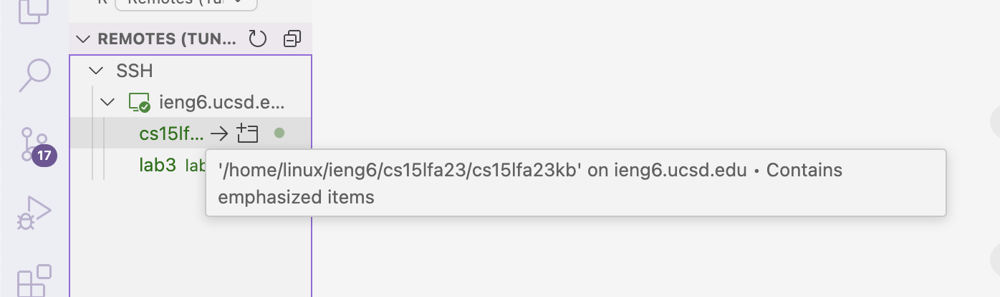
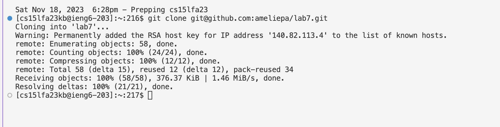
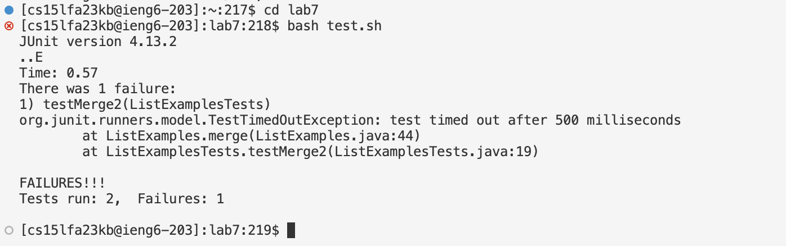
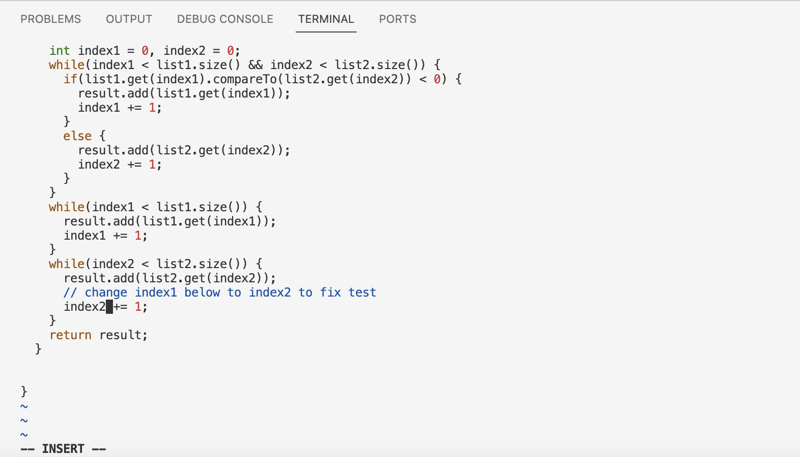
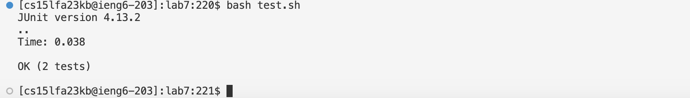
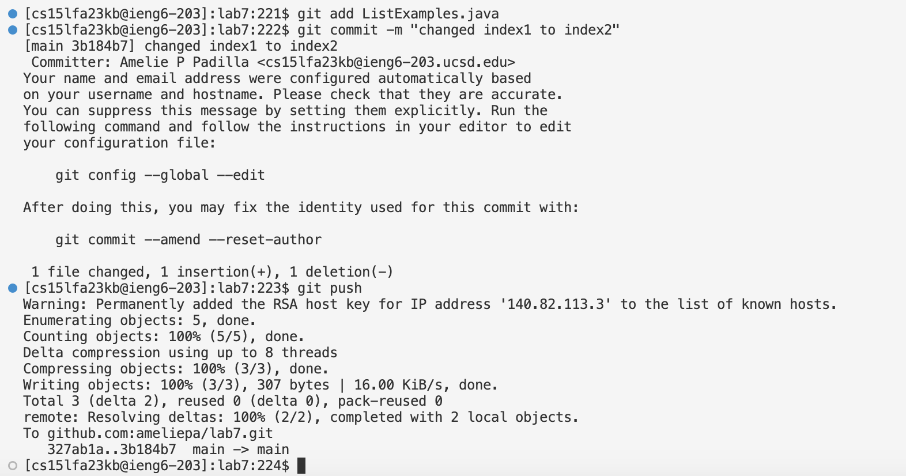

- **Logging into ieng6**  

No keys were used. I have an extension called Remote - SSH on VSCode that allows me to access my ieng6 account with one click.

- **Cloning the fork of the repository from my Github account (using the SSH URL)**  

**Keys used:** g, i, t, \<space>, c, l, o, n, e, \<space>, \<command> + V, \<enter>    
Used the git clone command to clone my repository onto my remote account.  

- **Running the tests, demonstrating that they fail**  

**Keys used:** c, d, \<space>, l, a, b, 7, \<enter>, b, a, s, h, \<space>, t, e, s, t, ., s, h, \<enter>    
Used cd command to change directory to lab 7, allowing me to then run the bash tests.  

- **Editing the code file to fix the failing test**  
Vim command:

Using vim:

**Keys used:** v, i, m, \<space>, L, i, s, t, E, x, a, m, p, l, e, s, ., j, a, v, a, \<enter>, scroll down and click on 1, x, i, 2, <esc>, :, w, q, \<enter>    
Used vim to edit the file from the command line. After enter was first pressed, the terminal was in vim. Pressing x after I clicked on 1 resulted in 1 being removed. Pressing i put me in insert mode where I was able to press 2, and use \<esc> to exit insert mode. The command \:wq allowed me to save my changes (the usage of the w) and quit vim (the usage of the q).  

- **Running the tests, demonstrating that they now succeed**  

**Keys used:** \<up arrow>,  \<up arrow>, \<enter>    
Used a shortcut to use the a previous command, `bash test.sh`. 

- **Committing and pushing the resulting change to my Github account**  

**Keys used:** g, i, t, \<space>, a, d, d, \<space>, L, i, s, t, E, x, a, m, p, l, e, s, ., j, a, v, a, \<enter>, g, i, t, \<space>, c, o, m, m, i, t, /<space>, -, m, \<space>, ", c, h, a, n, g, e, d, \<space>, i, n, d, e, x, 1, \<space>, t, o, \<space>, i, n, d, e, x, 2, ", \<space>, g, i, t, \<space>, p, u, s, h \<enter>    
I used git add stages the file ListExamples.java. git commit creates a commit locally for the file I just staged. The -m option allows me to add a commit message: "changed index1 to index2". Then, git push copies the changes to the remote server, GitHub.
