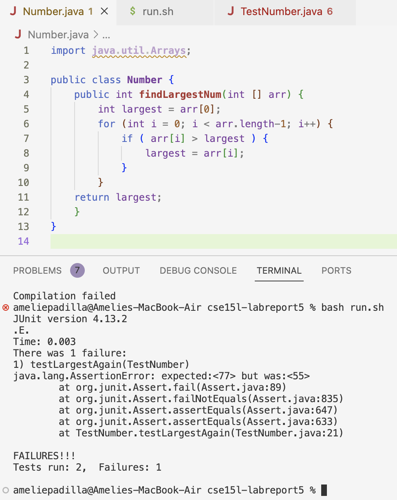
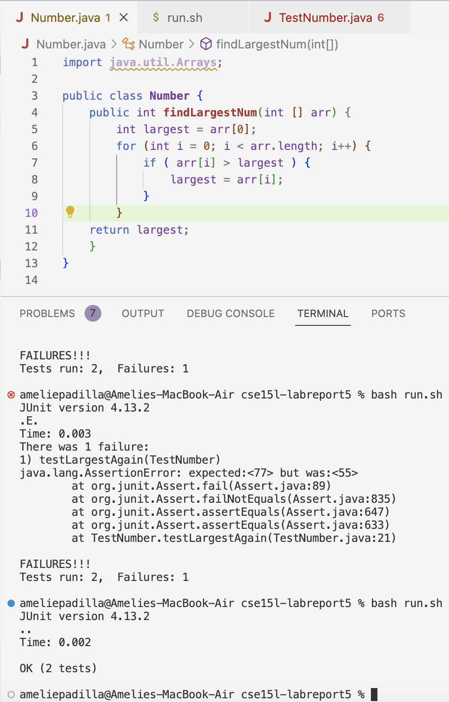
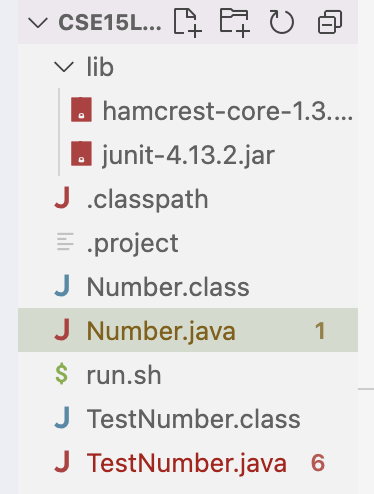

## Part 1 – Debugging Scenario

**Student:**
Hello, I am trying to write a program that finds the largest number in an array, but the wrong number is getting returned and I haven't been able to figure out what is wrong with my code. Could someone please point me to where the issue may be?
 

**TA:**
You should take a closer look at the parameters of your for loop. What are each of them doing?

**Student:**
I see, thank you! I got rid of the -1 and now the for loop checks all elements of the array, including the last index. 


**Setup Information:**
- The file & directory structure needed: <br />

- The contents of each file before fixing the bug: <br /> <br />
Number.java: 
```
import java.util.Arrays;

public class Number {
    public int findLargestNum(int [] arr) {
        int largest = arr[0];
	      for (int i = 0; i < arr.length-1; i++) {
		      if ( arr[i] > largest ) {
            largest = arr[i];
		    }
	    }
	  return largest;
    }
}
```
TestNumber.java:
```
import static org.junit.Assert.*;
import org.junit.*;
import java.util.*;
import java.util.ArrayList;


public class TestNumber {
	@Test
	public void testLargest() {
        Number numObj = new Number();
        int[] nums = new int []{5, 4, 3, 2, 1};
        int result = numObj.findLargestNum(nums);
        assertEquals(5, result);
        }

        @Test
        public void testLargestAgain() {
        Number numObj = new Number();
        int[] num2 = new int []{11, 33, 55, 77};
        int result2 = numObj.findLargestNum(num2);
        assertEquals(77, result2);
        }
}

```
run.sh: 
```
javac -cp .:lib/hamcrest-core-1.3.jar:lib/junit-4.13.2.jar *.java

if [ $? -eq 0 ]; then
    java -cp .:lib/hamcrest-core-1.3.jar:lib/junit-4.13.2.jar org.junit.runner.JUnitCore TestNumber
else
    echo "Compilation failed"
fi
```
- The full command line ran to trigger the bug:
```
ameliepadilla@Amelies-MacBook-Air cse15l-labreport5 % bash run.sh
JUnit version 4.13.2
.E.
Time: 0.003
There was 1 failure:
1) testLargestAgain(TestNumber)
java.lang.AssertionError: expected:<77> but was:<55>
        at org.junit.Assert.fail(Assert.java:89)
        at org.junit.Assert.failNotEquals(Assert.java:835)
        at org.junit.Assert.assertEquals(Assert.java:647)
        at org.junit.Assert.assertEquals(Assert.java:633)
        at TestNumber.testLargestAgain(TestNumber.java:21)

FAILURES!!!
Tests run: 2,  Failures: 1
```
- What to edit to fix the bug: The for loop within Number.java needed to be changed. `i < arr.length-1` needed to be changed to `i < arr.length` so that the loop would check all elements of the array instead of skipping the last element.


## Part 2 – Reflection

In the second half of this quarter, I have learned how to use vim, a way of editing files remotely from a command line. I have also learned how to create a bash file that can run tests for you. I now know some basic bash syntax, like using $ for variables, and how to write if/else statements (if, then, else, fi). 
